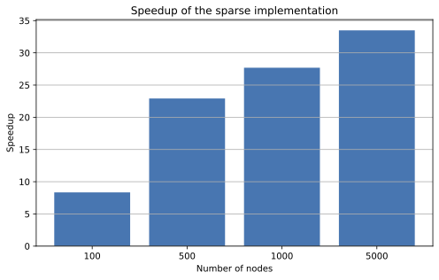

# Numerical Analysis of PageRank

This repository contains the implementation, numerical experiments, and final report for a project on the numerical analysis of the **PageRank algorithm**.

The project focuses on the power method, the effect of the damping factor, sparse and matrix-free computation, and an application to the **HEP-TH scientific citation network**.

## Key Results

- Implemented a sparse, matrix-free PageRank method with **O(m + n)** work and memory per iteration.
- Achieved a **39.1× speedup** over the dense formulation on a 5,000-node synthetic graph.
- Applied PageRank to the HEP-TH citation network containing **27,769 papers and 352,768 citation links**.
- Compared PageRank rankings with citation-count rankings and analyzed the effect of the damping factor on convergence.

## Project Structure

```text
numerical-analysis-pagerank/
├── README.md
├── requirements.txt
├── notebooks/
│   └── pagerank_analysis.ipynb
├── data/
└── report/
    └── report.pdf
```

- `notebooks/`: Jupyter notebook containing the implementation and numerical experiments.
- `data/`: HEP-TH citation-network data and metadata.
- `report/`: final project report.
- `requirements.txt`: Python dependencies required to run the notebook.

## Numerical Method

PageRank is formulated as the stationary distribution of the Google matrix and computed using the **power method**.

Instead of explicitly constructing the dense Google matrix, the implementation exploits the sparsity of the hyperlink matrix and handles the dangling-node and teleportation corrections in a matrix-free way.

For a graph with `n` nodes and `m` edges, each iteration requires:

- **O(m + n)** computational work;
- **O(m + n)** memory.

This makes the implementation suitable for substantially larger graphs than the corresponding dense formulation.

## Dataset

The experiments use the **High Energy Physics Theory (HEP-TH) citation network** distributed by the Stanford Network Analysis Project (SNAP).

In the directed graph, an edge from paper `i` to paper `j` indicates that paper `i` cites paper `j`.

After preprocessing the dataset by removing duplicate edges and self-citations, the network used in the experiments contains:

- **27,769 papers**
- **352,768 directed citation links**

## Numerical Results

The implementation was first validated on a small directed graph by comparing the power iteration with independent numerical formulations.

The sparse matrix-free implementation produced PageRank vectors equivalent to the dense formulation up to floating-point precision.

To study computational performance, dense and sparse implementations were compared on synthetic directed graphs of increasing size.

On a graph with **5,000 nodes and approximately 50,000 edges**, the sparse implementation achieved a **39.1× speedup** over the dense formulation.



The algorithm was then applied to the HEP-TH citation network to compare PageRank with standard citation-count rankings.

For a damping factor of `0.50`, PageRank converged in **20 iterations**, with a final residual of approximately `5.59e-9`.

The Spearman correlation between PageRank and citation count was approximately **0.868**, showing that the two rankings are strongly related but capture different aspects of paper importance.

## Running the Project

Clone the repository:

```bash
git clone https://github.com/RiccardoInfascelli/numerical-analysis-pagerank.git
cd numerical-analysis-pagerank
```

Create and activate a virtual environment:

```bash
python -m venv .venv
source .venv/bin/activate
```

On Windows:

```bash
.venv\Scripts\activate
```

Install the dependencies:

```bash
pip install -r requirements.txt
```

Then open:

```text
notebooks/pagerank_analysis.ipynb
```

using Jupyter Notebook, JupyterLab, or Visual Studio Code.

## Report

The complete project report is available at:

```text
report/report.pdf
```

It contains the mathematical formulation of PageRank, the sparse and matrix-free implementation, convergence analysis, numerical experiments, performance benchmarks, and the application to the HEP-TH citation network.

## Technologies

- Python
- NumPy
- SciPy
- Jupyter

## Author

**Riccardo Infascelli**  
M.Sc. High Performance Computing Engineering  
Politecnico di Milano